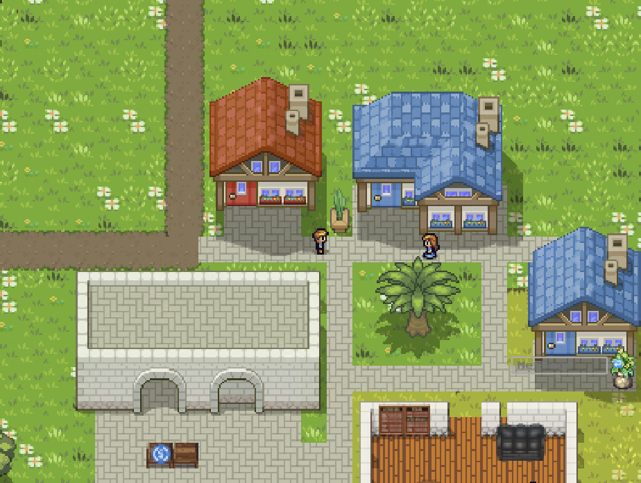

# Haciendas
A fun, social and visual way to interact with digital assets and DeFi protocols.
Informations available at https://haciendas.xyz/infos/




## Dev

### Launch
```bash
npm -g i liveserver
npm run dev
```

### Network
Haciendas can be used on testnets and mainnet, primarily built for **Sepolia**. Talk to the fox in-game to connect a browser wallet such as Metamask or Rabby. The fox will point you at the faucets list (https://haciendas.xyz/faucets/)

